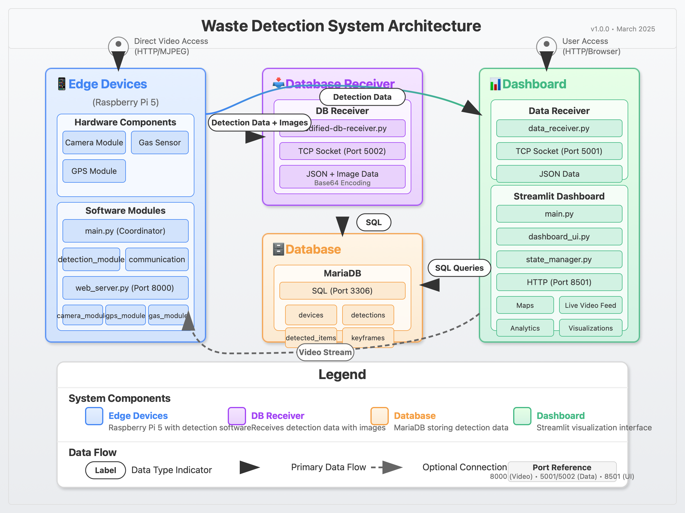

# Waste Detection System

A comprehensive IoT solution for real-time waste detection and monitoring using computer vision. This system integrates networked Raspberry Pi cameras with a centralized dashboard and database.

## System Overview

The Waste Detection System consists of three primary components:

1. **Edge Devices (Raspberry Pi)**: 
   - Capture video and detect waste items using computer vision
   - Provide real-time video streaming via a web server
   - Include optional gas sensor and GPS modules
   - Send detection data to the dashboard and database components

2. **Dashboard Server**:
   - Streamlit-based web interface for real-time monitoring
   - Interactive map showing device locations and status
   - Live video feed viewing capabilities
   - Historical data visualization and analysis
   - Connection management for all edge devices

3. **Database Server**:
   - MariaDB database for persistent storage of detection data
   - Custom receiver script for processing data from edge devices
   - Stores device information, detection events, and keyframe images
   - Supports historical data analysis and reporting

## System Architecture





## Directory Structure

```
waste-detection-system/
├── README.md                 # This file - system overview
├── docs/                     # Additional documentation
│   └── system-architecture.png
├── new-pi/                   # Edge device code for Raspberry Pi
│   ├── pi-README.md          # Setup guide for Raspberry Pi devices
│   ├── config.py             # Device configuration
│   ├── main.py               # Main application entry point
│   ├── requirements.txt      # Pi-specific dependencies
│   ├── modules/              # Modular components
│   │   ├── camera_module.py  # Camera interface
│   │   ├── detection_module.py # Waste detection logic
│   │   ├── communication.py  # Network communication
│   │   ├── web_server.py     # Web server for video streaming
│   │   ├── gps_module.py     # GPS module interface
│   │   └── gas_sensor_module.py # Gas sensor interface
│   └── logs/                 # Log directory for Pi devices
├── waste-dashboard/          # Dashboard application
│   ├── dashboard-README.md   # Dashboard setup and usage guide
│   ├── requirements.txt      # Dashboard dependencies
│   ├── main.py               # Dashboard entry point
│   ├── dashboard_ui.py       # Streamlit UI components
│   ├── data_receiver.py      # Socket server for receiving data
│   ├── state_manager.py      # Manages application state
│   └── logs/                 # Dashboard log directory
└── waste-db/                 # Database component
    ├── db-README.md          # Database setup guide
    ├── requirements.txt      # Database dependencies
    ├── modified-db-receiver.py # Database receiver script
    └── logs/                 # Database log directory
```

## Quick Start

### Set Up Each Component

For detailed instructions on setting up each component, see the respective README files:

1. **Edge Devices (Raspberry Pi)**: [pi-README.md](new-pi/pi-README.md)
2. **Dashboard**: [dashboard-README.md](waste-dashboard/dashboard-README.md)
3. **Database**: [db-README.md](waste-db/db-README.md)

### Install Required Dependencies

Each component has its own set of dependencies:

#### For Database Server:
```bash
cd waste-db
pip install -r requirements.txt
```

#### For Dashboard Server:
```bash
cd waste-dashboard
pip install -r requirements.txt
```

#### For Edge Devices (Raspberry Pi):
```bash
cd new-pi
pip install -r requirements.txt
```

## Network Configuration

For proper communication between components, configure the following:

1. **Edge Devices**:
   - Set dashboard and database server IPs in `new-pi/config.py`
   - Ensure network access to dashboard (port 5001) and database (port 5002)

2. **Dashboard**:
   - Configure database connection in `waste-dashboard/dashboard_ui.py`
   - Ensure it can reach all edge devices on port 8000 (for video feeds)

3. **Database**:
   - Configure MariaDB to accept remote connections if needed
   - Ensure database receiver is listening on port 5002

## System Features

### Waste Detection
- Real-time detection of waste items (plastic, paper, glass)
- Classification with confidence scores
- Bounding box visualization
- Detection event logging

### Environmental Monitoring
- Gas detection using MQ-2 sensor
- GPS location tracking
- Timestamp and geolocation for each detection

### Real-time Visualization
- Interactive map of all devices
- Live video feed from any device
- Detection statistics and trends
- Gas alert monitoring

### Historical Analysis
- Time-series visualization of detection data
- Waste type distribution analysis
- Detection hotspot mapping
- Performance metrics

## Troubleshooting

For troubleshooting specific components, refer to their respective README files. Common system-wide issues:

1. **Connectivity Issues**:
   - Verify all devices are on the same network or can route to each other
   - Check firewall settings for required ports (5001, 5002, 8000)
   - Test connectivity with `ping` and `telnet` commands

2. **Synchronization Problems**:
   - Ensure all devices have accurate time settings
   - Use NTP for time synchronization: `sudo apt install ntp`

3. **System Resource Limitations**:
   - Monitor CPU, memory, and storage on all devices
   - Reduce workload on resource-constrained devices by lowering frame rates or detection frequency

## Security Considerations

This system includes several sensitive components that should be secured for production use:

1. **Change default passwords**
2. **Use encryption for data transmission**
3. **Implement user authentication for dashboard access**
4. **Restrict network access to required ports only**
5. **Keep all system components updated with security patches**

## Contributing

Guidelines for contributing to this project:

1. Follow the existing code structure and naming conventions
2. Document all changes and additions
3. Submit pull requests with clear descriptions of changes
4. Include tests for new functionality
5. Update relevant documentation

## License

This software is provided under [LICENSE TERMS].

## Support

For support, contact the development team at [CONTACT INFORMATION].
